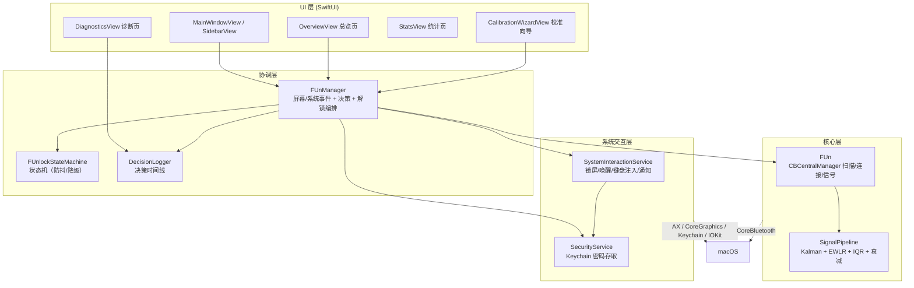
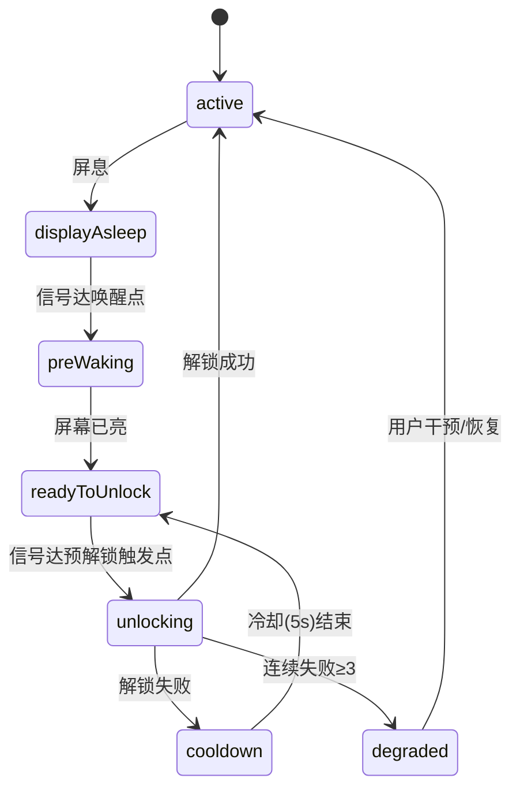

# FUnlock 技术架构与开发者指南

> 面向开发者：FUnlock（macOS 菜单栏应用）的内部架构、信号处理管线、状态机与核心流程说明。

## 1. 项目概述

FUnlock 通过监测 BLE 设备的 RSSI 信号强度，实现"靠近自动解锁、离开自动锁屏"。纯 macOS 端实现（Swift + SwiftUI + CoreBluetooth），不依赖 iOS App，密码通过 Keychain 安全存储，解锁时以辅助功能权限注入键盘事件。

| 项目 | 说明 |
|---|---|
| 语言/框架 | Swift 5.7+、SwiftUI（菜单栏 Popover + 多窗口）、CoreBluetooth |
| 系统要求 | macOS 13.0+，需「蓝牙」与「辅助功能」权限 |
| 测试 | XCTest（`FUnlockTests` 目标，约 3700 行用例） |
| 多语言 | Base(en) + zh-Hans/ja/de/sv/nb/da/tr |
| 主要依赖 | 无第三方库（系统框架为主），自研信号管线 |

## 2. 架构总览



**数据流（一次解锁）**：`BLE 广播 → FUn(CBCentralManager 回调) → SignalPipeline 处理 → effectiveRSSI → FUnManager 判断阶梯阈值 → 状态机校验 → SystemInteractionService 注入密码 → Keychain 取密 → 验证解锁结果 → DecisionLogger 记录`。

## 3. 模块清单

| 文件 | 职责 | 关键类型/函数 |
|---|---|---|
| `FUn.swift` | BLE 核心：扫描、连接、设备表、RSSI 更新、定时器 | `FUn`(NSObject+CBCentralManagerDelegate)、`preWakeThreshold`、`unlockStairThreshold`、`smoothedRSSI(_:)`、`lockTimeout(slope:base:)`、`isNearThreshold(_:threshold:)` |
| `FUnManager.swift` | 编排层：屏幕/系统事件、解锁/锁定决策、诊断记录、更新检查 | `@Published state/rssi/lockRSSI/unlockRSSI`、`attemptAutoUnlock()`、`onDeviceApproached()`、`onSystemScreenLocked()`、`recordUnlock(_:reason:detail:)` |
| `FUnlockStateMachine.swift` | 解锁状态机：冷却、连续失败降级 | `State`(active/displayAsleep/preWaking/readyToUnlock/unlocking/cooldown/degraded)、`canAttemptUnlock` |
| `SignalPipeline.swift` | 信号处理管线（值类型，线程安全） | `process(rssi:source:now:) -> SignalDecision`、`UnfairLock` |
| `SystemInteractionService.swift` | 系统能力封装：锁屏、唤醒、键盘注入、通知、解锁验证 | `wakeDisplay()`、`lockOrSaveScreen(...)`、`injectPasswordWithPrelude(...)`、`verifyUnlock(...)` |
| `SecurityService.swift` | Keychain 密码读写 | — |
| `DecisionLogger.swift` | 决策事件落盘 + 读取（时间线） | `record(category:outcome:reason:detail:)`、`loadHistory()` |
| `OverviewView.swift` | 总览页：信号盘、阈值条、偏移量输入 | `ThresholdSliderRow`、`ThresholdOffsetRow` |
| `DiagnosticsView.swift` | 诊断页：时间线 + 建议按钮 | — |
| `StatsView.swift` | 统计页 | — |
| `CalibrationWizardView.swift` | 阈值校准向导 | — |
| `SignalDataStore.swift` / `RingBuffer.swift` | 信号历史与环形缓冲 | — |
| `WiFiMonitor.swift` | 指定 Wi-Fi 暂停锁屏 | — |
| `TelemetryLogger.swift` / `Log.swift` / `DebugLog.swift` | 遥测/日志 | — |
| `UpdateDownloader.swift` / `UpdateInstaller.swift` | 自动更新 | — |
| `appleDeviceNames.swift` | 设备厂商名映射 | — |

## 4. 核心机制

### 4.1 信号处理管线（SignalPipeline）

单次采样 `process(rssi:source:now:)` 依次执行 5 个阶段：

1. **S0 源标记**：连接态源权重 `1.0`，扫描态 `0.7`。
2. **S1 IQR 异常检测**：滑动窗口（≥5 样本）四分位距法，超过 `2.0 × IQR` 判定为异常样本。
3. **S2 EWLR 斜率**：1.5 秒窗口内按 `λ=0.4` 指数衰减加权的加权最小二乘斜率，经 `α=0.3` EMA 平滑，clamp 到 ±30。
4. **S3 自适应 Kalman**：静态参数 `Q=0.008 / R=0.5`；快速上升时 `Q` 按偏差、正斜率、异常标记放大（上限 `0.5`），让"靠近"快速跟随；下降方向不加速，抑制抖动。
5. **S4 自适应时间衰减**：离开期间 `effectiveRSSI` 以 `0.5/s` 基础速率衰减（下限 -100），作为丢包惩罚；斜率陡降时衰减加快（`× (1+0.3|slope|)`），长期无操作时衰减放缓（`÷ (1+0.05·elapsed)`）。

输出 `SignalDecision(kalmanEstimate, effectiveRSSI, slope, isAnomalous, sourceWeight)`，其中 `effectiveRSSI` 是锁屏/解锁判断的主输入。

### 4.2 阶梯阈值派生（FUn）

三个动作点全部由用户可调的**解锁基准阈值**派生（`dBm` 数值越小越远）：

| 动作 | 公式 | 默认（解锁基准 -65 时） |
|---|---|---|
| 预备唤醒（亮屏） | `unlockRSSI - wakeAdvance` | `-85`（提前 20 dB） |
| 预解锁触发（弹密码框） | `unlockRSSI - preUnlockTrigger` | `-75`（提前 10 dB） |
| 解锁基准 | 用户校准 | `-65` |

- 偏移量经 `FUn.clampOffset(_:)` 钳制到 `0...20`，默认值集中在 `FUn.defaultWakeAdvance / defaultPreUnlockTrigger`。
- `FUn.smoothedRSSI(_:)`（EMA，`α=0.3`）供唤醒判断二次平滑。
- 阈值变更通过 `FUnManager.thresholdVersion` 自增通知 UI 刷新。

### 4.3 解锁状态机（FUnlockStateMachine）



- 解锁冷却 `5s`，失败冷却 `10s`，连续失败 ≥3 进入 `degraded`（降级，不再自动尝试，发本地通知）。
- `transition(to:)` 有合法路径校验，非法迁移被忽略。

### 4.4 决策时间线（DecisionLogger）

每次"为什么没解锁/为什么锁屏"记录为结构化 `DecisionEvent`（category / outcome / reason / detail / timestamp），按日分文件落盘（含大小上限滚动），诊断页按日期分组渲染，并为常见原因附操作建议按钮。事件源包括系统事件、用户操作、解锁尝试结果（`recordUnlock / recordLock / recordSystem / recordUser`）。

### 4.5 解锁流程（attemptAutoUnlock 摘要）

```
onDeviceApproached → 阶梯阈值门控
  ├─ 平滑值 < preWakeThreshold      → 忽略
  ├─ screen == displaySleeping 且 ≥ preWake → startWakeRetry()（预备唤醒，置 pending）
  └─ 平滑值 ≥ unlockStairThreshold  → 状态机 canAttemptUnlock？
       ├─ 否（冷却/降级） → recordUnlock(.skipped)
       └─ 是 → guardFetchPassword()（Keychain）
             → performInjectionAndVerify（SystemInteractionService 注入 + 轮询验证）
             → 成功/失败/超时 → 记入决策日志 + 统计
```

## 5. 公共 API 参考（节选）

### FUn（核心）

| 签名 | 说明 |
|---|---|
| `func scanForPeripherals()` / `startScanning()` / `stopScanning()` | 扫描控制 |
| `func startMonitor(uuid: UUID)` | 开始监测指定设备 |
| `func getEffectiveRSSI() -> Double` | 读取当前有效信号 |
| `func updateRSSI(rssi: Int?, active: Bool)` | 外部喂入采样 |
| `var preWakeThreshold: Int` / `var unlockStairThreshold: Int` | 派生阶梯阈值 |
| `static func lockTimeout(slope:base:) -> TimeInterval` | 按斜率计算锁屏超时（陡降快速锁） |
| `static func isNearThreshold(_:threshold:) -> Bool` | 接近窗口判断 |
| `static func clampOffset(_:) -> Int` | 偏移钳制 0...20 |

### FUnManager（编排）

| 签名 | 说明 |
|---|---|
| `func onSystemScreenLocked()` / `onDisplaySleep/Wake()` / `onSystemSleep/Wake()` | 系统事件入口 |
| `func onDeviceApproached()` / `onDeviceLeft(reason:)` | 靠近/离开 |
| `func onRSSIUpdated(rssi:active:)` | 信号更新入口 |
| `func attemptAutoUnlock()` | 尝试自动解锁（含门控与验证） |
| `func lockNow()` | 立即锁定 |
| `func setLockRSSI / setUnlockRSSI(_:)` | 阈值写入（含钳制） |
| `func setWakeAdvance / setPreUnlockTrigger(_:)` | 偏移写入（含钳制） |
| `var thresholdVersion: Int` | 阈值版本（UI 监听刷新） |

### SystemInteractionService

| 签名 | 说明 |
|---|---|
| `func isScreenLocked(screenState:) -> Bool` | 锁屏状态查询 |
| `func wakeDisplay()` | 唤醒显示器 |
| `func lockOrSaveScreen(useScreensaver:sleepDisplayAfter:)` | 锁定/屏保 |
| `func injectPasswordWithPrelude(_:isSecureCheck:) -> Bool` | 注入密码（带前导 Shift 键） |
| `func waitForUnlockNotification(timeout:) async -> Bool` | 等待解锁通知 |
| `func verifyUnlock(...)` | 解锁结果验证 |

## 6. 构建与测试

```bash
# 全量测试（含状态机、决策日志、信号管线用例）
xcodebuild -project FUnlock.xcodeproj -scheme FUnlock -destination 'platform=macOS' test

# Release 构建
xcodebuild -project FUnlock.xcodeproj -scheme FUnlock -configuration Release -derivedDataPath build build
```

测试组织：`FUnlockTests/FUnlockTests.swift`（主测试）、`FUnlockStateMachineTests.swift`、`DecisionLoggerTests.swift`、`ReasonActionMappingTests.swift`。

## 7. FAQ

**Q: 解锁判定用什么信号？**
A: `SignalPipeline.process` 输出的 `effectiveRSSI`（Kalman 估计 − 时间衰减惩罚）。判断靠近用"渐强 + 斜率"，离开用"渐弱 + 超时"。

**Q: 为什么靠近了还不解锁？**
A: 依次检查：① 信号是否达到 `unlockStairThreshold`（看总览页实时计算值）；② 状态机是否处于冷却/降级；③ 屏幕是否为 `displaySleeping`（此时只会预备唤醒）；④ 系统锁定状态与辅助功能权限是否正常。以上均可在诊断页时间线查看具体原因（`recordUnlock` 的 detail）。

**Q: 修改偏移量后为何 UI 显示值与实际不符？**
A: 偏移量写入时会经 `clampOffset` 钳制到 0...20，超界输入会被修正。正常范围（如 唤醒 20 / 预解锁 10）不受影响。

**Q: 加新界面/新事件要注意什么？**
A: 系统事件统一走 `FUnManager.onXxx` 入口并在 `DecisionLogger` 落点；信号管线保持无锁（UnfairLock 仅保护共享状态）；阈值派生不要写死数值，统一走 `FUn` 的派生属性与 `clampOffset`。

**Q: 蓝牙权限被拒会怎样？**
A: `FUn.bluetoothPowerWarn()` 触发告警，UI 引导去系统设置授权；解锁/锁定流程会被跳过并记录到决策日志。
